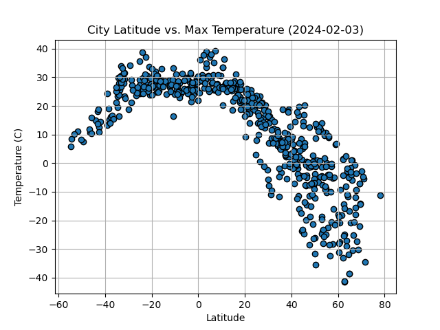
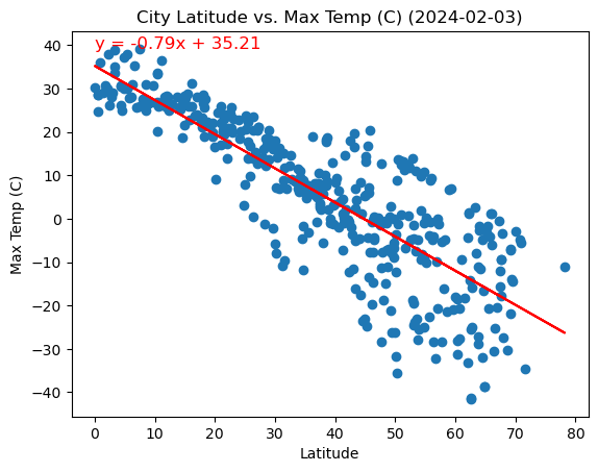
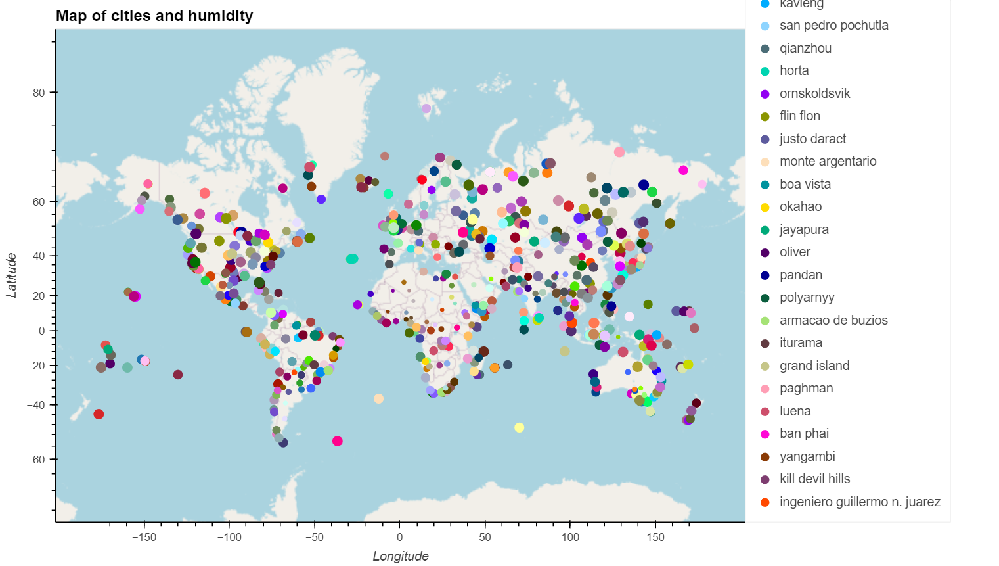

# python-api-challenge

## Project overview

1. Create visualisations to show that as we approach the equator the weather gets hotter.

    * The below scatter shows a plot of 500 cities from OpenWeatherMap API and their maximum temperatures (on the date the data was called). At the equator (latitude=0), the maximum temperature reaches the peak of the concave downward visualisation.  
    
    * Visualisations of latitude vs humidity, cloudiness and wind speed show either weak or little correlation.
    * Of particular note, for the northern hemisphere, there is a strong linear correlation that the closer the latitude gets toward the equator, temperature increases proportionally.
    

2. Create an interactive map to show cities with ideal weather conditions for a vacation.

    * Using Geoapify to plot humidity of cities, it shows that the humidity is lowest (smaller data point size) when closest to the equator (latitude=0) and Prime Meridian (longitude=0). However, this relationship could not be determined using a linear regression model.
    

## Data sources

* OpenWeatherMap API
* Geoapify

## References

1. [Format OpenWeather date value](https://stackoverflow.com/questions/68694155/getting-the-datetime-text-in-the-openweathermap-api-in-python)
2. [Copy specific columns in a pandas DataFrame](https://saturncloud.io/blog/fastest-way-to-copy-columns-from-one-dataframe-to-another-using-pandas/)
3. [Get value from a column in a pandas DataFrame by referencing the index](https://www.geeksforgeeks.org/pandas-dataframe-get_value/)